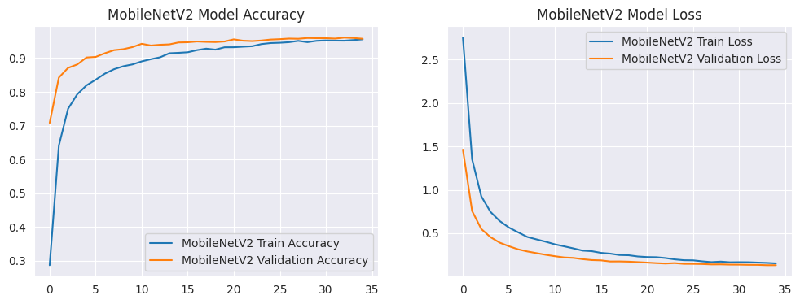
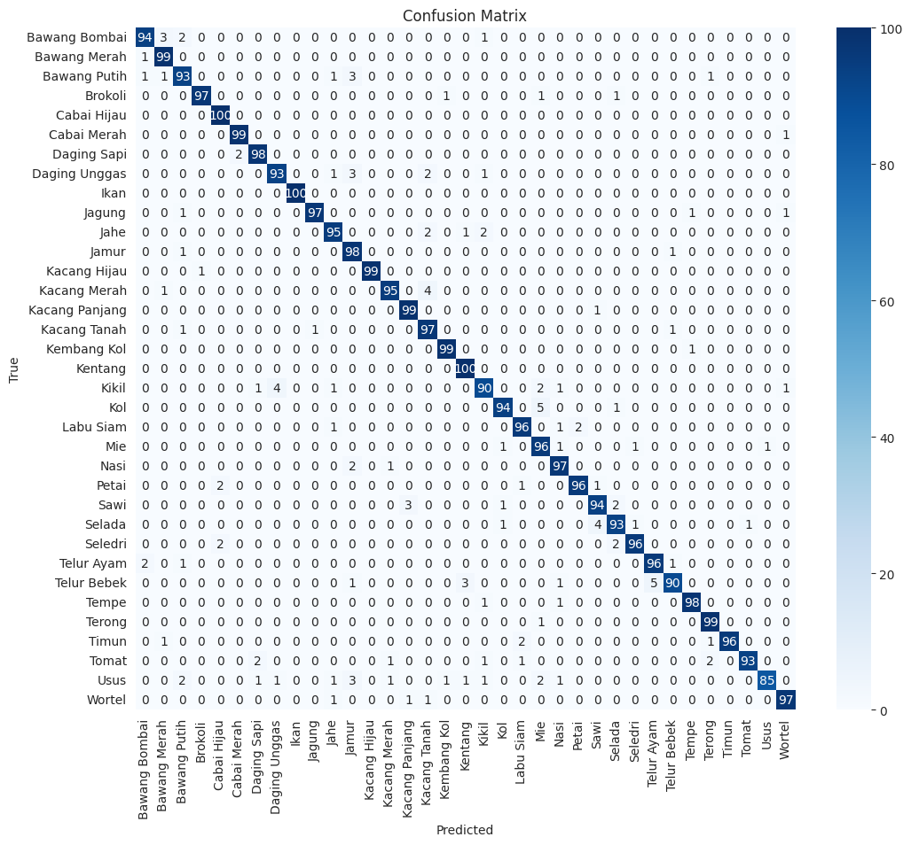
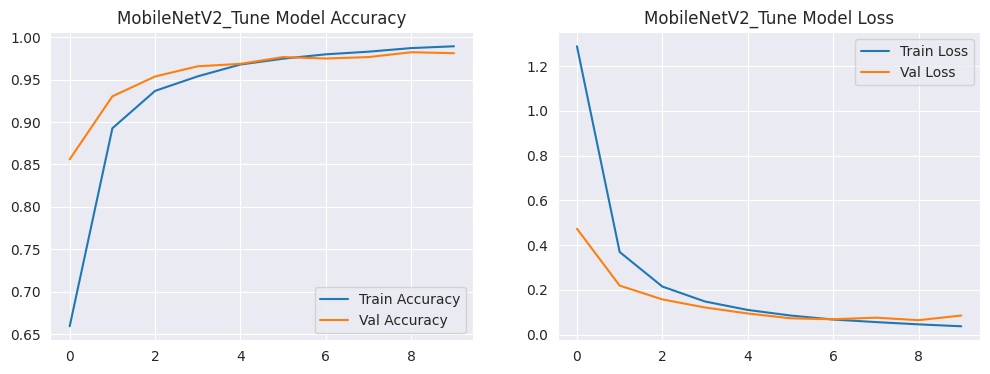
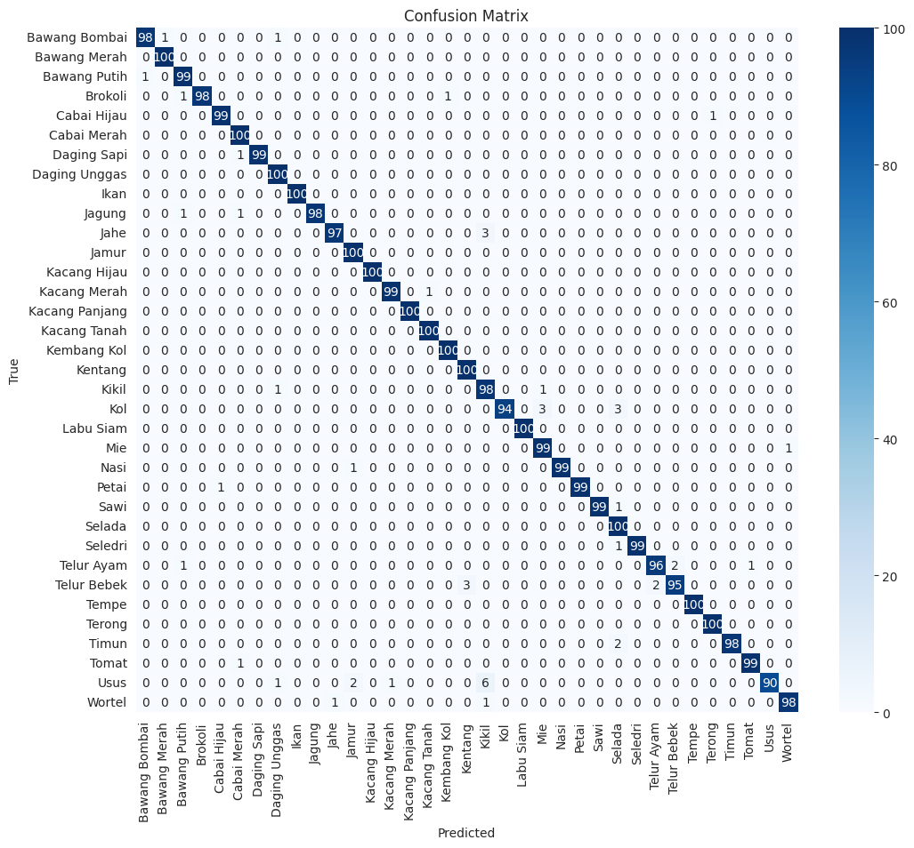

<h1 align="center"> 🥕 Machine Learning Eatzi 🍗 </h1>

## Model Development

Proyek ini berfokus pada pembangunan dan optimisasi model *Convolutional Neural Network* (CNN) untuk klasifikasi gambar, khususnya untuk mengidentifikasi berbagai jenis bahan makanan. Kami memanfaatkan arsitektur **MobileNetV2** sebagai dasar, dikombinasikan dengan teknik *fine-tuning* dan optimisasi menggunakan *callback* Keras untuk mencapai kinerja yang optimal.

### Persiapan Data

* **Dataset:** Model dilatih menggunakan dataset yang terdiri dari gambar-gambar berbagai jenis bahan makanan.
* **Link:** https://www.kaggle.com/datasets/zollycitraprayogi/food-ingredients-image
* **Pra-pemrosesan Gambar:** Gambar di-*resize* ke dimensi `(224, 224)` piksel dan dinormalisasi (dibagi 255.0) untuk mempersiapkan input bagi model.
* **Augmentasi Gambar:** Untuk meningkatkan ketahanan dan generalisasi model serta mengurangi *overfitting*, teknik augmentasi gambar ekstensif diterapkan pada data pelatihan. Augmentasi ini membantu model terpapar variasi gambar yang lebih luas.
    * `rescale`: 1./255
    * `rotation_range`: 20
    * `zoom_range`: 0.2
    * `horizontal_flip`: True
    * `shear_range`: 0.2
    * `height_shift_range`: 0.2
    * `width_shift_range`: 0.2
* **Pembagian Data:** Dataset dibagi menjadi set pelatihan dan validasi untuk memantau kinerja model pada data yang belum terlihat.
    * **Data Train:** Digunakan untuk melatih model (70%)
    * **Data Test:** Digunakan untuk melakukan testing pada model (20%)
    * **Data Val:** Digunakan untuk mengevaluasi kinerja model selama pelatihan (10%)
* **Generator Data:** `ImageDataGenerator` digunakan untuk memuat dan mengaugmentasi data secara efisien dalam *batch*, yang sangat penting untuk dataset berukuran besar.

### Menggunakan MobileNetV2 (Arsitektur Model)

Model inti kami dibangun di atas arsitektur **MobileNetV2**, sebuah model yang efisien dan *pre-trained* yang cocok untuk keterbatasan sumber daya.

* **Model Dasar (Base Model):** Kami memulai dengan instans **MobileNetV2** yang telah dilatih sebelumnya pada dataset ImageNet. Lapisan-lapisan konvolusi dari model dasar ini (`base_model`) diatur agar tidak dapat dilatih (`trainable=False`) pada awalnya. Hal ini memungkinkan kami memanfaatkan fitur-fitur tingkat rendah dan menengah yang telah dipelajari MobileNetV2 tanpa mengubahnya, menghemat waktu pelatihan dan sumber daya komputasi.
* **Custom Classification Head:** Di atas `base_model` MobileNetV2, kami menambahkan lapisan-lapisan kustom untuk menyesuaikan model dengan tugas klasifikasi 35 kelas bahan makanan kami:
    * **Lapisan `GlobalAveragePooling2D`**: Digunakan untuk merangkum fitur-fitur spasial dari output *base model* menjadi vektor tunggal per citra, mengurangi dimensi dan parameter secara signifikan.
    * **Lapisan `Dense` (Output)**: Ini adalah lapisan output klasifikasi dengan `35` unit (sesuai dengan jumlah kelas bahan makanan) dan fungsi aktivasi `softmax`. `softmax` memastikan output adalah distribusi probabilitas di atas semua kelas, cocok untuk klasifikasi multi-kelas.

### Kompilasi Model Awal

Model dikompilasi dengan konfigurasi awal sebelum *fine-tuning*:

* **Optimizer:** `Adam` digunakan.
* **Fungsi Kerugian (Loss Function):** `tf.keras.losses.SparseCategoricalCrossentropy` digunakan karena label kelas kami adalah integer (bukan *one-hot encoded*).
* **Metrik:** `accuracy` 

### Pelatihan Awal

Model dilatih dengan hanya melatih *custom classification head* sambil menjaga *base model* tetap beku.

* `epochs`: 35
* `steps_per_epoch`: Dihitung berdasarkan ukuran set pelatihan.
* `validation_steps`: Dihitung berdasarkan ukuran set validasi.

### Evaluasi Model
Berikut merupakan hasil dari pelatihan awal setelah di evaluasi mendapatkan hasil sebagai berikut:
```
110/110 ━━━━━━━━━━━━━━━━━━━━ 10s 93ms/step - accuracy: 0.9656 - loss: 0.1094
MobileNetV2 Test accuracy: 0.9594, Test loss: 0.1309
```





### Modifikasi MobileNetV2 dengan Fine-Tuning + Optimisasi Callback

Setelah pelatihan awal, kami menerapkan *fine-tuning* pada model dasar untuk meningkatkan kinerja lebih lanjut, dengan bantuan *callback* Keras untuk pelatihan yang lebih stabil dan efisien.

* **Pembekuan Lapisan:** Beberapa lapisan atas dari `base_model` MobileNetV2 di-*unfreeze* (diatur menjadi `trainable=True`) untuk memungkinkan penyesuaian bobot selama *fine-tuning*. Lapisan-lapisan yang lebih dalam tetap dibekukan untuk mempertahankan fitur-fitur fundamental.
* **Kompilasi Model untuk Fine-Tuning:** Model dikompilasi ulang dengan *learning rate* yang lebih rendah untuk *fine-tuning*, memastikan bahwa perubahan pada bobot *base model* tidak terlalu drastis.
    * **Optimizer:** `Adam` dengan `learning_rate` = `0.0001`
    * **Fungsi Kerugian (Loss Function):** Tetap `tf.keras.losses.SparseCategoricalCrossentropy`.
    * **Metrik:** Tetap `accuracy`.
* **Optimisasi Callback:** Callback berikut digunakan selama fase *fine-tuning* untuk mengoptimalkan proses pelatihan:
    * **`ModelCheckpoint`:** Secara otomatis menyimpan bobot model terbaik berdasarkan `val_accuracy` ke file `model-klasifikasi.h5`. Ini menjamin kami selalu memiliki versi model dengan kinerja validasi terbaik.
    * **`EarlyStopping`:** Memantau `val_loss`. Jika `val_loss` tidak menunjukkan peningkatan selama sejumlah *epoch* (`patience`) tertentu (misalnya, 5 atau 10 *epochs*), pelatihan akan dihentikan lebih awal. Ini mencegah *overfitting* dan menghemat waktu.
    * **`ReduceLROnPlateau`:** Memantau `val_loss`. Jika `val_loss` tidak menunjukkan penurunan selama sejumlah *epoch* (`patience`) tertentu, *learning rate* akan dikurangi (misalnya, faktor `0.2` atau `0.5`). Ini membantu model untuk keluar dari *local minima* dan mencapai konvergensi yang lebih baik.

### Pelatihan Fine-Tuning

Model dilanjutkan pelatihannya dengan *fine-tuning* pada lapisan yang telah di-*unfreeze* dan *learning rate* yang lebih rendah.

* `epochs`: (total *epochs* setelah *fine-tuning*, 10 epoch)
* `initial_epoch`: Dimulai dari *epoch* terakhir pelatihan awal.
* `steps_per_epoch`: Dihitung berdasarkan ukuran set pelatihan.
* `validation_steps`: Dihitung berdasarkan ukuran set validasi.
* `callbacks`: Callback `ModelCheckpoint`, `EarlyStopping`, dan `ReduceLROnPlateau` diterapkan.

### Evaluasi Model

Setelah seluruh proses pelatihan (termasuk *fine-tuning*) selesai, model dievaluasi pada set validasi untuk mendapatkan metrik kinerja akhir.

* **Hasil Evaluasi:**
```
110/110 ━━━━━━━━━━━━━━━━━━━━ 9s 84ms/step - accuracy: 0.9896 - loss: 0.0502
Test accuracy: 0.9857, Test loss: 0.0510
```
    * `Loss`: (0.0510)
    * `Accuracy`: (0.9857)

#### Visualisasi





### Penyimpanan Model

Model yang telah dilatih sepenuhnya diekspor dan disimpan dalam format TensorFlow SavedModel atau format `.h5` (seperti `model-klasifikasi.h5` oleh `ModelCheckpoint`) untuk penggunaan dan inferensi.
